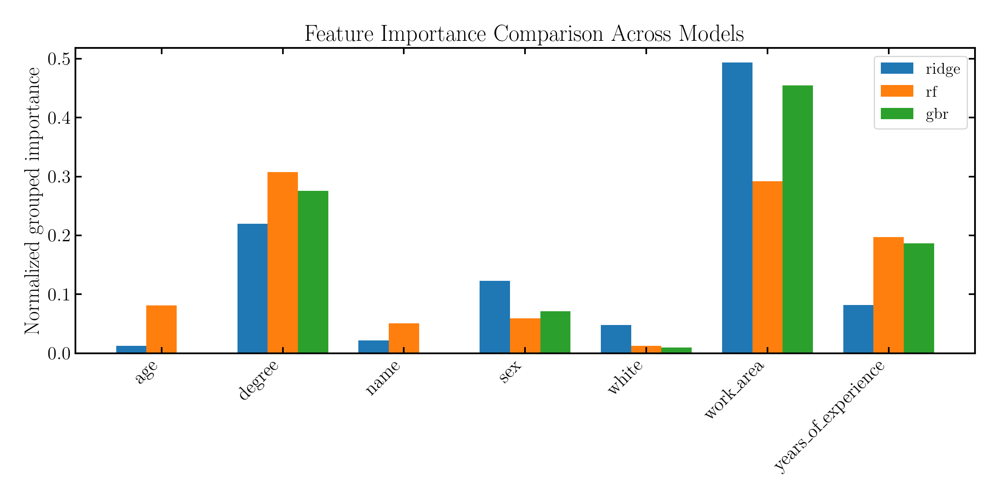
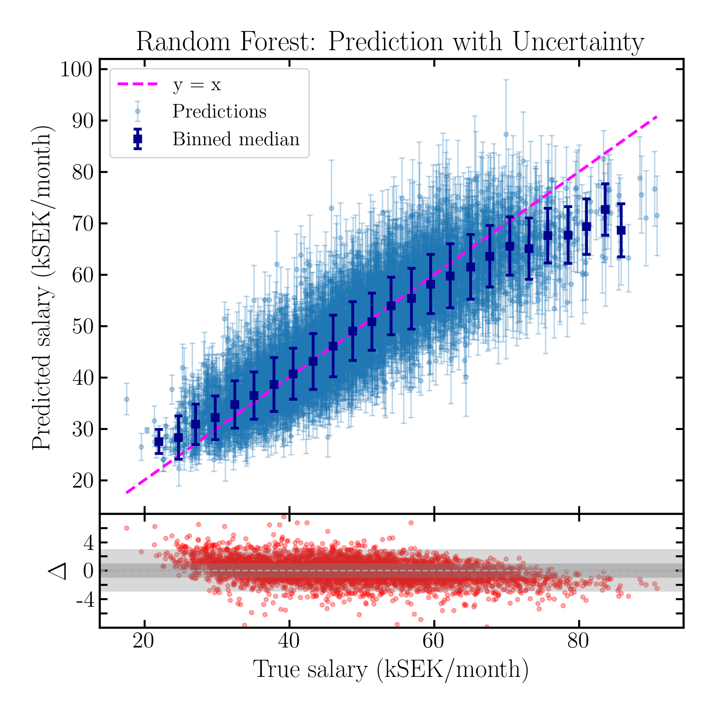

# mock_salaries

A small machine learning project based on a fully synthetic salary dataset with a known ground truth.

The goal is not to maximise predictive performance, but to investigate how different machine learning models recover relationships that are deliberately embedded in the data generation process.

## Overview

The dataset is generated from simulated workers with attributes such as:

* Name
* Sex
* Age
* Ethnicity (white / non-white)
* Degree status
* Work area
* Years of experience

Salaries are assigned using a predefined model that combines:

* Baseline salary distributions
* Experience-dependent salary increases
* Work-area salary multipliers
* Degree bonuses
* Demographic biases
* Random noise

Because the true salary model is known, it is possible to evaluate not only predictive accuracy but also whether machine learning models identify the correct drivers of salary.

## Project Structure

```text
mock_salaries/
├── data/
│   └── simulated_salaries.csv
├── src/
│   ├── person.py
│   ├── salary_model.py
│   └── generate_dataset.py
├── notebooks/
│   └── analysis.ipynb
└── README.md
```

## Models Evaluated

The notebook compares three regression approaches:

1. Ridge Regression
2. Random Forest Regressor
3. Gradient Boosting Regressor

All models are trained using the same train/test split and preprocessing pipeline. Ridge has an improved performance using a Quantile scaler instead of a Standard one. 

## Main Findings

### Predictive Performance

Gradient Boosting achieved the best overall performance:

| Model             | Test R² |
| ----------------- | ------- |
| Ridge             | ~0.76   |
| Random Forest     | ~0.79   |
| Gradient Boosting | ~0.80   |

### Feature Importance Recovery

One of the most interesting results is how differently the models handle irrelevant or proxy features.

The synthetic dataset was designed so that:

* Years of experience is highly informative.
* Work area is informative.
* Name is not directly informative.
* Age is not directly informative.

<p align="left">
  
</p>

Gradient Boosting correctly assigns very little importance to age and name, focusing instead on the true salary drivers.

Ridge Regression behaves similarly, although less strongly.

Random Forest assigns noticeably more importance to name, likely because names are correlated with sex in the synthetic population and can therefore act as proxy variables; similarly, age correlates with years of experience.

### Model Behaviour

All models exhibit a tendency to predict values closer to the population mean:

* Low salaries tend to be overestimated.
* High salaries tend to be underestimated.

This effect is particularly visible in predicted-vs-actual diagnostic plots.

<p align="left">
  
</p>

## Motivation

The project was created as a lightweight environment for experimenting with:

* Feature engineering
* Model comparison
* Interpretability
* Bias and proxy variables
* Uncertainty estimation
* Regression diagnostics

without relying on external datasets.
